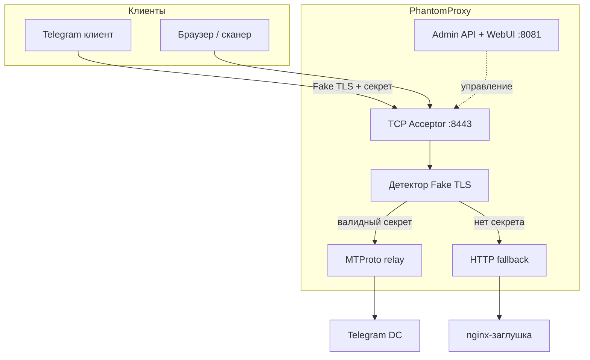

# PhantomProxy — Fake TLS MTProto-прокси на Go

[](https://go.dev/)
[](https://github.com/RioTwWks/PhantomProxy/actions/workflows/ci.yml)
[](LICENSE)

**PhantomProxy** — TCP-прокси, который маскирует трафик Telegram MTProto под обычный HTTPS (Fake TLS). Предназначен для обхода DPI-фильтрации, блокирующей протокол MTProto.

Проект написан на **Go** с акцентом на сетевое программирование, многопоточность и минимальные зависимости.

## Возможности

- **Fake TLS** — эмуляция TLS-рукопожатия с браузерными отпечатками (JA3/JA4) через `utls`
- **Динамические TLS-записи** — случайный размер Application Data для усложнения статистического анализа DPI
- **Multi-user** — несколько MTProto-секретов с сопоставлением по ClientHello
- **HTTP fallback** — посторонние соединения проксируются на сайт-заглушку
- **Domain fronting** — TCP splice на mask host при невалидном TLS (probe resistance)
- **Anti-replay** — кеш ClientHello против повторного проигрывания
- **Протокол `dd`** — secure obfuscated2 на том же порту
- **DRS + Split-TLS** — имитация браузерных паттернов записей
- **Prometheus** — метрики на `:9090/metrics`
- **SOCKS5 upstream** — выход в DC через туннель
- **PROXY protocol** — поддержка v1 за nginx/HAProxy
- **WebUI** — встроенный дашборд (HTMX, без внешних зависимостей)
- **Конфигурация** — YAML + переменные окружения (`PHANTOM_*`)

## Архитектура



Подробнее: [docs/ARCHITECTURE.md](docs/ARCHITECTURE.md)

## Структура проекта

```
cmd/proxy/              — точка входа
configs/                — пример конфигурации
internal/
  admin/                — REST API и WebUI
  config/               — загрузка/сохранение YAML
  faketls/              — Fake TLS, JA3/JA4, TLS-записи
  fallback/             — HTTP-прокси на заглушку
  mtproto/              — парсинг секретов
  obfuscated2/          — obfuscated2 handshake
  proxy/                — TCP-акцептор и маршрутизация
  runtime/              — общее состояние, reload
  stats/                — метрики соединений
  telegram/             — резолв Telegram DC
  testclient/           — тестовый MTProto-клиент
  testdc/               — mock Telegram DC
  user/                 — multi-user manager
web/                    — статика для nginx-заглушки
docs/                   — документация
```

## Требования

- Go 1.22+
- `make` (опционально)
- Docker + Docker Compose (для локального теста с заглушкой)

## Установка и запуск

### Из исходников

```bash
git clone https://github.com/RioTwWks/PhantomProxy.git
cd PhantomProxy
make build
./telegram-proxy -config configs/config.yaml
```

По умолчанию:
- прокси слушает `0.0.0.0:8443`
- API и WebUI — `http://127.0.0.1:8081/ui/`

### Через go install

```bash
go install github.com/RioTwWks/PhantomProxy/cmd/proxy@latest
telegram-proxy -config ~/.config/phantomproxy/config.yaml
```

### Docker Compose

```bash
docker compose up --build
```

Поднимает nginx-заглушку (`:8080`), прокси (`:8443`) и WebUI (`:8081`).

## Конфигурация

Пример `configs/config.yaml`:

```yaml
listen:
  host: "0.0.0.0"
  port: 8443

mtproto:
  backend: ""           # пусто = авто-резолв DC Telegram
  users:
    - name: alice
      secret: "ee367a189aee18fa31c190054efd4a8e9573746f726167652e676f6f676c65617069732e636f6d"
      enabled: true

tls:
  record_min_chunk: 512
  record_max_chunk: 4096
  noise_mean: 3000
  noise_jitter: 800
  # allowed_ja3: []     # опциональный белый список JA3

fallback:
  upstream: "http://127.0.0.1:8080"

management:
  host: "127.0.0.1"
  port: 8081
  token: "change-me-in-production"
  public_server: ""     # публичный IP/домен для tg:// ссылок в UI
```

Полный справочник полей и env-переменных: [docs/CONFIG.md](docs/CONFIG.md)

### Обратная совместимость

Вместо `mtproto.users` можно указать один `mtproto.secret` — будет создан пользователь `default`.

## Подключение в Telegram

Ссылка формируется автоматически в WebUI (`/ui/users`) или через API:

```
tg://proxy?server=YOUR_IP&port=8443&secret=ee0123456789...
```

Укажи `management.public_server`, если прокси слушает `0.0.0.0`, а ссылки нужны с публичным адресом.

Подробнее: [docs/ROADMAP.md](docs/ROADMAP.md) · [docs/DEPLOY.md](docs/DEPLOY.md)

## API и WebUI

| Сервис | URL | Аутентификация |
|--------|-----|----------------|
| WebUI | `http://127.0.0.1:8081/ui/` | токен через `/ui/login` |
| REST API | `http://127.0.0.1:8081/api/v1/` | `Authorization: Bearer <token>` или `X-API-Token` |
| Health | `GET /api/v1/health` | без токена |

Полное описание эндпоинтов: [docs/API.md](docs/API.md)

## Тестирование

```bash
make test          # unit-тесты (race detector)
make integration   # интеграционные тесты (mock DC, без Docker)
make lint          # golangci-lint (если установлен)
```

Интеграционные тесты используют build tag `integration` и поднимают in-process mock Telegram DC.

## Разработка

- Руководство для контрибьюторов: [CONTRIBUTING.md](CONTRIBUTING.md)
- Правила проекта: [.cursorrules](.cursorrules)
- Гайд для агентов: [AGENTS.md](AGENTS.md)
- Локальные MCP-серверы: [.cursor/mcp.json](.cursor/mcp.json)

## Лицензия

MIT © 2026 RioTwWks
