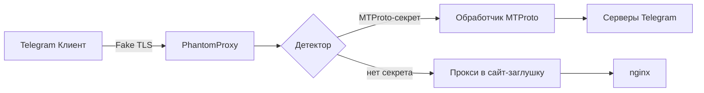

# PhantomProxy — Fake TLS MTProto-прокси на Go

[](https://go.dev/)
[](LICENSE)

**PhantomProxy** — это высокопроизводительный прокси-сервер, который маскирует трафик Telegram под обычный HTTPS (TLS 1.3). Разработан для обхода DPI-фильтрации, используемой в некоторых странах для блокировки протокола MTProto.

Проект написан на **Go** — прагматичном языке с отличной поддержкой сетевого программирования и многопоточности.

## 🎯 Возможности

- **Fake TLS**: полная эмуляция TLS-рукопожатия с браузерными отпечатками (JA3/JA4).
- **Динамический размер записей**: изменяет размер TLS-фреймов, чтобы нарушить статистический анализ DPI.
- **Маскировка**: любой запрос без корректного MTProto-секрета перенаправляется на сайт-заглушку (nginx).
- **Легкая настройка**: конфигурация через YAML/TOML, поддержка переменных окружения.
- **Высокая производительность**: использование горутин и неблокирующего I/O.

## 🏗️ Архитектура



- **Акцептор** — слушает порт (443/13443) и принимает соединения.
- **Детектор** — анализирует первый пакет, проверяет наличие корректного секрета.
- **Обработчик MTProto** — проксирует трафик до серверов Telegram.
- **Заглушка** — отдает статический сайт (или проксирует на реальный домен).

## 📦 Требования

- Go 1.22+
- make (опционально)
- Docker (для тестирования с заглушкой)

## 🚀 Установка и запуск

### Из исходников

```bash
git clone https://github.com/your-username/PhantomProxy.git
cd PhantomProxy
make build
./build/PhantomProxy -config configs/config.yaml
```

### Через `go install`

```bash
go install github.com/your-username/PhantomProxy/cmd/PhantomProxy@latest
PhantomProxy -config ~/.config/PhantomProxy/config.yaml
```

### Docker

```bash
docker build -t PhantomProxy .
docker run -p 443:443 -v $(pwd)/configs:/app/configs PhantomProxy
```

## ⚙️ Конфигурация

Пример `config.yaml`:

```yaml
listen:
  host: "0.0.0.0"
  port: 443

tls:
  cert_file: "/path/to/cert.pem"
  key_file: "/path/to/key.pem"
  fake_domain: "www.google.com"     # SNI для маскировки

mtproto:
  secret: "ee0123456789abcdef..."    # префикс ee для Fake TLS
  backend: "149.154.167.99:443"      # реальные серверы Telegram

fallback:
  upstream: "http://localhost:8080"  # сайт-заглушка
```

## 🔌 Подключение в Telegram

Получите ссылку вида:

```
tg://proxy?server=YOUR_IP&port=443&secret=ee0123456789...
```

Вставьте в Telegram, нажмите "Подключиться".

## 🧪 Тестирование

```bash
make test          # unit-тесты
make integration   # интеграционные тесты (требует Docker)
```

## 🧩 MCP-интеграция

Проект поставляется с MCP-сервером на Go (официальный SDK). Добавьте в `~/.cursor/mcp.json`:

```json
{
  "mcpServers": {
    "PhantomProxy": {
      "command": "PhantomProxy-mcp",
      "args": ["--config", "/path/to/config.yaml"]
    }
  }
}
```

Это позволит управлять прокси (перезагрузка, смена секретов, просмотр статистики) прямо через Cursor.

## 📄 Лицензия

MIT © 2026 RioTwWks
