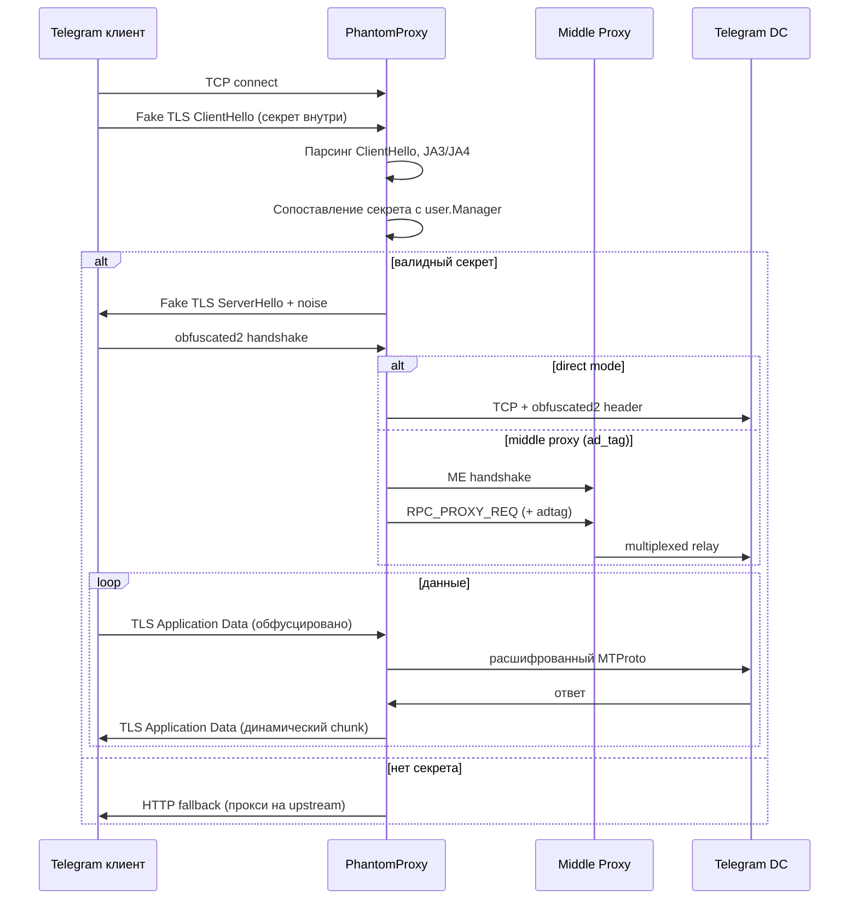

# Архитектура PhantomProxy

## Обзор

PhantomProxy — это TCP-прокси без терминации TLS на уровне `crypto/tls`. Вместо этого клиент Telegram отправляет **Fake TLS** ClientHello, а прокси:

1. Распознаёт MTProto-секрет внутри ClientHello
2. Отвечает синтетическим ServerHello (с padding/noise)
3. Устанавливает obfuscated2-сессию и ретранслирует трафик в Telegram DC

Посторонние клиенты (браузеры, сканеры) получают HTTP-проксирование на `fallback.upstream`.

## Поток соединения MTProto

## Пакеты

### `internal/proxy`

TCP-акцептор с **hot-reload listen** (`RebindListenIfNeeded`). На каждое соединение — отдельная горутина. Читает первый пакет, вызывает детектор, маршрутизирует в MTProto relay (direct или middle proxy) или fallback.

### `internal/middleproxy`

Telegram Middle Proxy transport:

- ME handshake (RPC_NONCE → RPC_HANDSHAKE, AES-CBC)
- `RPC_PROXY_REQ` / `RPC_PROXY_ANS` для мультиплексирования клиентских соединений
- Встраивание `ad_tag` (промо-тег от @MTProxybot)
- Включается при `mtproto.use_middle_proxy` или наличии `mtproto.ad_tag`
- Несовместимо с SOCKS5 upstream

### `internal/service`

Удаление systemd-сервиса: `Uninstall`, `ScheduleUninstall`, скрипт `deploy/uninstall.sh`.

### `internal/faketls`

- Парсинг ClientHello (SNI, cipher suites, extensions)
- Вычисление JA3/JA4 отпечатков
- Генерация ServerHello с `utls`
- `RecordPolicy` — случайная нарезка Application Data на TLS-записи
- `NoiseParams` — padding в ServerHello

### `internal/user`

Thread-safe менеджер пользователей (`sync.RWMutex`):

- Сопоставление входящего ClientHello с секретом
- CRUD через API
- Опциональный белый список JA3 (`tls.allowed_ja3`)
- Генерация секретов с кастомным SNI-доменом

### `internal/obfuscated2`

Реализация obfuscated2 handshake поверх Fake TLS:

- Извлечение ключа из ClientHello
- AES-CTR шифрование потока после рукопожатия

### `internal/mtproto`

Парсинг и кодирование hex-секретов MTProto (`ee` + random + domain).

### `internal/telegram`

Резолв адреса Telegram DC. Если `mtproto.backend` пуст, используется встроенный список DC.

### `internal/fallback`

HTTP reverse proxy для не-MTProto соединений. Проксирует на `fallback.upstream` (обычно nginx с `web/index.html`).

### `internal/runtime`

Общее состояние между прокси и admin API:

- `Snapshot()` / `UpdateConfig()` — thread-safe доступ к конфигу
- `Reload()` — перечитывание YAML + rebind listen (через admin)
- `UpdateSettings()` — изменение настроек + запись на диск + rebind listen

### `internal/stats`

Счётчики соединений и трафика (общие и per-user).

### `internal/admin`

HTTP-сервер управления:

- REST API (`/api/v1/*`)
- WebUI (`/ui/*`) — `go:embed` шаблоны и статика

### `internal/config`

Загрузка через Viper (YAML + `PHANTOM_*` env). Сохранение через `gopkg.in/yaml.v3`.

## Тестовая инфраструктура

| Пакет | Назначение |
|-------|------------|
| `internal/testclient` | Эмуляция Telegram-клиента (Fake TLS + obfuscated2) |
| `internal/testdc` | Mock Telegram DC с AES-CTR |
| `internal/proxy/integration_test.go` | E2E прокси ↔ mock DC (`-tags=integration`) |
| `internal/proxy/listen_test.go` | Hot-reload listen port |
| `internal/proxy/e2e_telegram_test.go` | E2E против реального DC (`-tags=realtelegram`) |
| `internal/faketls/fuzz_test.go` | Fuzz ParseClientHello |
| `internal/mtproto/secret_fuzz_test.go` | Fuzz ParseSecret |

Интеграционные тесты: `go test -tags=integration ./internal/proxy/...`

E2E Telegram (opt-in): `PHANTOM_E2E_TELEGRAM=1 go test -tags=realtelegram ./internal/proxy/...`

Fuzz в CI: 30s на `FuzzParseClientHello`, `FuzzParseSecret`.

## Конкурентность

- Каждое TCP-соединение — отдельная горутина в `proxy.Server`
- `runtime.Runtime` и `user.Manager` защищены `RWMutex`
- `stats.Tracker` — атомарные счётчики
- Graceful shutdown: `signal.NotifyContext` → закрытие listener → `WaitGroup` на активные соединения

## Безопасность

- Management API по умолчанию слушает только `127.0.0.1`
- Обязательно смени `management.token` в production
- Конфиг с секретами записывается с правами `0600`
- WebUI-сессия = значение токена в cookie (без JWT)

## Ограничения

- Изменение `listen.port` через API/UI применяется без перезапуска (hot-reload listener)
- Middle proxy требует публичный IPv4 для handshake (`middle_proxy_nat_ip` за NAT)
- Middle proxy несовместим с SOCKS5 upstream
- Нет встроенного TLS-терминатора для management (используй reverse proxy)
- Один инстанс = один конфиг-файл (без кластеризации)
- E2E против реального Telegram — flaky, opt-in CI job
